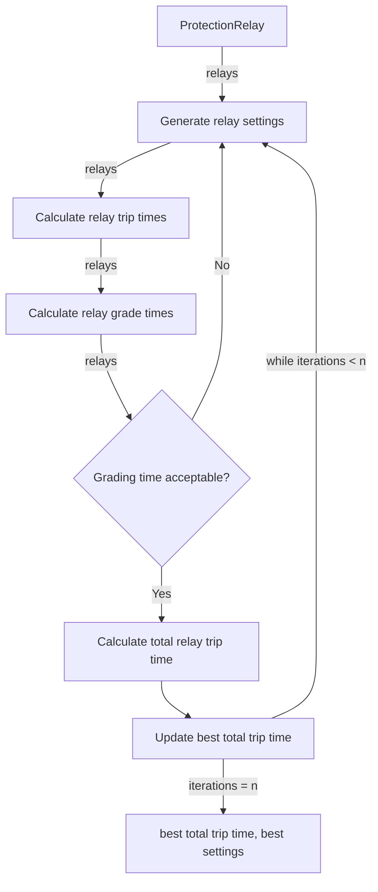
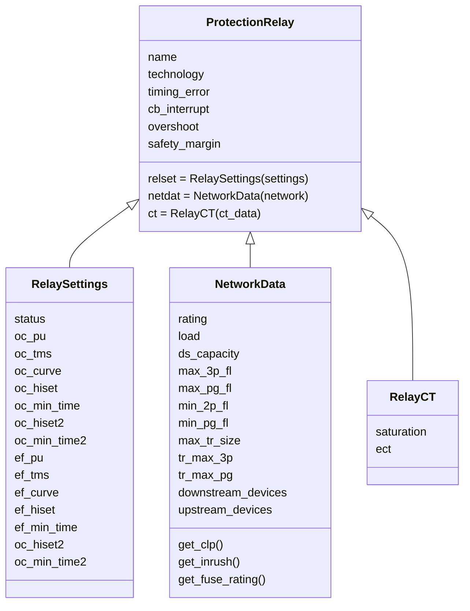

# Protection Coordination
# https://mermaid-js.github.io.
# https://mermaid.live

oc_pickup()
The order of priority of constraints, from highest to lowest, is as follows:
1) Stay above load (load_factor) t
2) Stay below primary reach factor (oc_reach)
3) Stay below backup reach factor (oc_bu_reach)
4) Stay above conductor rating (rating_factor)
5) Stay below upstream relay pickup (upstream_oc)
6) Stay above downstream relay pickup (oc_pu_factor)
7) Stay above 4x downstream fuse rating (fuse_factor_02)
8) Stay above 3x downstream fuse rating (fuse_factor_01)

ef_pickup()
The order of priority of constraints, from highest to lowest, is as follows:
1) Stay above 10% of max load (load_factor)
2) Stay below primary reach factor (ef_reach)
3) Stay below backup reach factor (ef_bu_reach)
4) Stay below upstream relay pickup (upstream_ef)
5) Stay above downstream relay pickup (ef_pu_factor)
6) Stay below 33% of lowest fault (fault factor)

